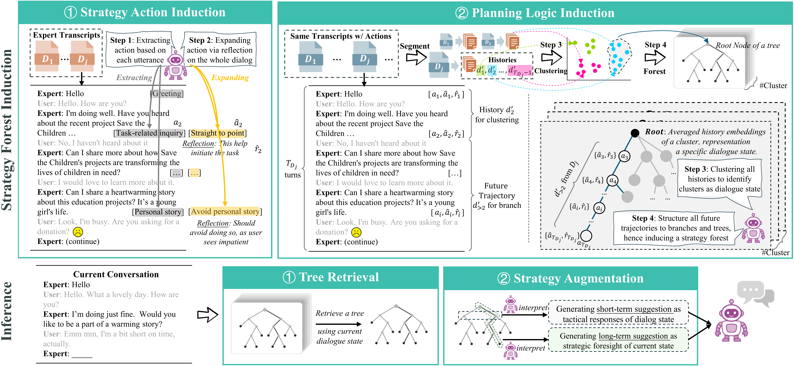

# 🚀 METRO: Strategy Induction for Non-collaborative Dialogues

**ACL 2026**

This repository contains the official implementation of the ACL 2026 paper:  
“METRO: Towards Strategy Induction from Expert Dialogue Transcripts for Non-collaborative Dialogues”

📄 **Paper link:** (to be added)  
🧪 **Baselines:** [non-cooperative-dialogue-baseline](https://github.com/Humphrey-0125/non-cooperative-dialogue-baseline)

---

## ✨ Overview

METRO proposes a strategy induction framework that learns structured dialogue strategies from expert demonstrations.

The pipeline includes:

- **State Representation** – encode dialogue history
- **State Clustering** – group similar dialogue states
- **Strategy Induction** – build strategy trees (MCT-based)
- **Strategy Execution** – simulate dialogues with induced strategies
- **Evaluation** – task-specific metrics

**Supported datasets:**

- P4G (Persuasion for Good)
- CB (Craigslist Bargain)
- ESC (Emotional Support Conversation)


<p align="center">
  
</p>

---

## ⚡ Quick Start

1. **Install**
   ```bash
   python -m venv .venv
   source .venv/bin/activate   # or .venv\Scripts\activate on Windows
   pip install -r requirements.txt
   ```

2. **Set API Keys**
   ```bash
   export OPENAI_API_KEY=your_key
   export SILICONFLOW_API_KEY=your_key
   ```

3. **Run METRO (Recommended)**
   ```bash
   # P4G
   bash run_all.sh --dataset p4g --cluster-config kmeans_k150

   # CB
   bash run_all.sh --dataset cb --cluster-config kmeans_k80
   ```

---

## 🧠 Pipeline (Minimal)

If you want to reproduce the full pipeline:

```bash
python src/data_process/pipeline_dataset.py --dataset p4g --steps all --k 100 --normalize
```

**Steps:**

- State → Cluster → Strategy Induction → Principle Split

---

## 🎯 Evaluation

```bash
python src/evaluate/metrics.py <input_file> --dataset p4g
```

---

## 📁 Structure

```
src/
├── data_process/     # preprocessing + clustering + strategy induction
├── runtime/          # dialogue simulation
├── evaluate/         # evaluation metrics
└── utils/            # embeddings / APIs / tools
```

---

## 📌 Key Idea

Unlike prior work that relies on flat strategy retrieval, METRO:

- 🌲 Builds a Strategy Forest (tree-structured planning)
- 🔍 Captures long-term dialogue transitions
- ⚡ Enables both short-term and long-term reasoning

---
